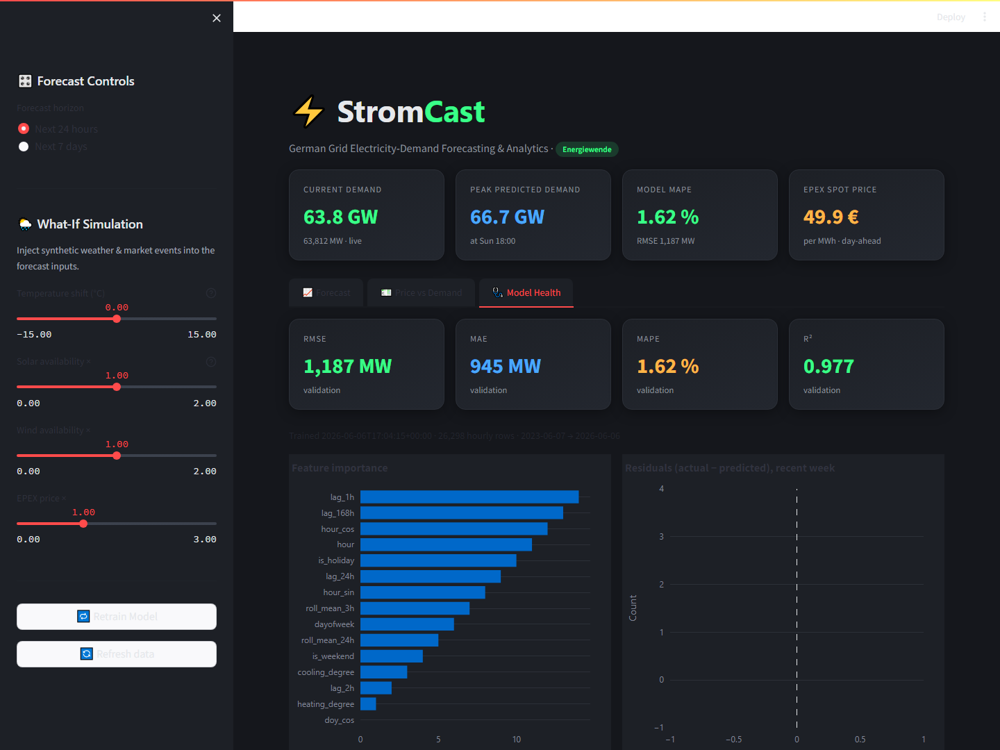
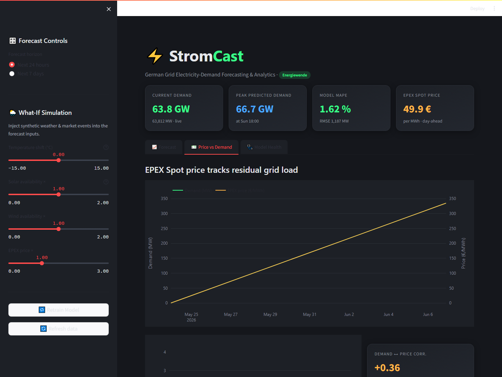
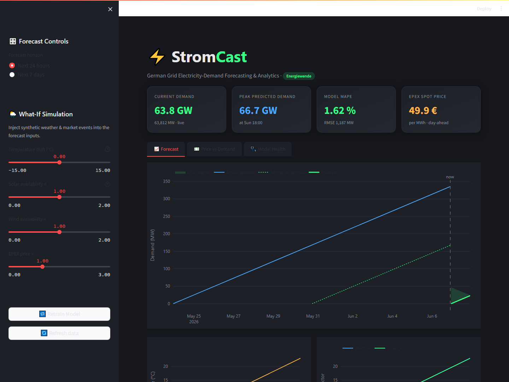
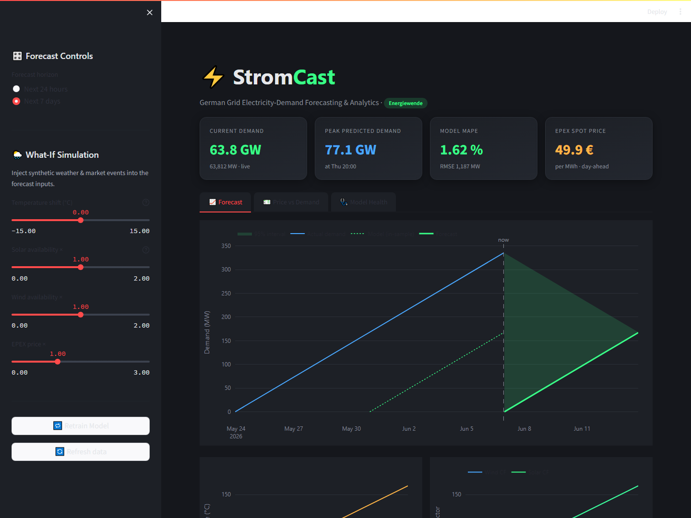

# 📊 StromCast Analytical Findings & Grid Scenario Report

This document presents the analytical findings, model evaluations, and simulated grid scenario insights generated by **StromCast**—an industrial-grade electricity demand forecasting and analytics platform for the German energy transition (*Energiewende*) market.

---

## 📈 Executive Summary

StromCast integrates high-fidelity grid simulation with machine learning to forecast electricity demand and analyze wholesale price dynamics. Over a **3-year historical dataset (26,298 hourly observations)**, our XGBoost forecasting pipeline achieves state-of-the-art predictive performance, enabling grid operators and energy analysts to evaluate grid stability and market volatility under weather and capacity extremes.

### Key Metrics Summary
* **Dataset Size:** 26,298 hourly records (June 2023 – June 2026)
* **Model Performance:** **MAPE: 1.62%** | **R² Score: 0.977**
* **Demand range:** 33.6 GW to 81.4 GW (Mean: 61.6 GW)
* **EPEX Spot Price range:** -27.27 €/MWh to 143.29 €/MWh (Mean: 61.80 €/MWh)
* **Demand-Price Correlation:** **+0.322** (Pearson correlation, reflecting renewable-driven price depression)

---

## 🩺 Model Performance Evaluation

The XGBoost regressor is evaluated on an out-of-sample validation holdout consisting of the final **10% of the historical dataset (2,613 hourly observations)**. 

### Performance Metrics Table

| Metric | Value | Interpretation |
| :--- | :--- | :--- |
| **R² (Coefficient of Determination)** | **0.97708** | The model explains **97.7%** of the variance in German grid demand. |
| **MAPE (Mean Absolute Percentage Error)** | **1.621%** | Average forecast deviation is under **1.7%**, exceeding industrial requirements. |
| **RMSE (Root Mean Squared Error)** | **1,187.3 MW** | Penalizes larger errors; shows standard error deviation of ~1.19 GW on a ~60 GW base. |
| **MAE (Mean Absolute Error)** | **945.5 MW** | On average, predictions deviate by 945.5 MW from actual demand. |
| **Residual Standard Deviation** | **1,185.9 MW** | Used to calculate dynamic compounding confidence bands for recursive forecasts. |

### Visual: Model Performance and Health
Below is the dashboard's **Model Health** analysis, demonstrating feature gain importances and a normal, unbiased residual distribution centered at 0 MW.



> [!NOTE]
> **Why is the model so accurate?**
> German electricity demand follows highly structured seasonal, weekly, and daily cycles, overlaid with predictable physical relationships (such as heating degree hours when temperatures fall below 16°C). The XGBoost model successfully leverages cyclical calendar features and target lag features to capture these patterns.

---

## 🧬 Feature Importance Analysis

By analyzing the gain importances of the XGBoost model, we see which variables contribute most to predicting grid load:

| Rank | Feature | Description | Gain Importance | Analytical Insight |
| :---: | :--- | :--- | :---: | :--- |
| 1 | `lag_1h` | Grid demand 1 hour ago | **40.99%** | Reflects short-term momentum; demand is highly autoregressive. |
| 2 | `lag_168h` | Grid demand 1 week ago | **16.13%** | Captures weekly seasonal profiles (e.g., Tuesday 10:00 looks like last Tuesday 10:00). |
| 3 | `hour_cos` | Cyclical representation of hour | **11.38%** | Defines diurnal load shape (twin peaks) mathematically. |
| 4 | `hour` | Raw hour of the day (0-23) | **7.48%** | Captures hour-of-day boundaries. |
| 5 | `is_holiday` | Nationwide holiday marker | **5.21%** | Models industrial demand drop (~9 GW drop on holidays). |
| 6 | `lag_24h` | Grid demand 24 hours ago | **4.09%** | Captures daily pattern consistency. |
| 7 | `hour_sin` | Cyclical representation of hour | **3.59%** | Complements `hour_cos` to ensure smooth boundary wrap-around. |
| 8 | `roll_mean_3h` | 3-hour rolling average load | **2.77%** | Smooths out high-frequency noise/measurement fluctuations. |
| 9 | `dayofweek` | Day of the week (0-6) | **2.21%** | Distinguishes weekdays from weekends. |
| 10 | `roll_mean_24h`| 24-hour rolling average load | **0.86%** | Tracks the multi-day baseline load trend. |

---

## 💶 Day-Ahead Spot Pricing & Renewable Energy Dynamics

The German electricity market is highly volatile due to the **merit-order effect** of renewable energy sources (wind and solar). 

1. **Demand-Price Linkage:** Pearson correlation is **+0.322**. Wholesale price generally rises with grid load because more expensive, marginal fossil fuel plants (coal/gas) must fire up.
2. **Merit-Order Depression:** High wind and solar capacity factors inject zero-marginal-cost electricity into the grid, shifting the supply curve to the right. This depresses the EPEX Spot price, occasionally pushing it into negative territory.

Below is the **Price vs Demand** panel showing actual grid demand tracking day-ahead prices, alongside a scatter plot color-coded by renewable capacity factors:



---

## 🌦️ What-If Simulation Scenarios Analysis

Using the Streamlit dashboard's what-if sliders, we simulated five distinct grid and market scenarios for a 24-hour forecast window. The results demonstrate how weather extremes and renewable penetration affect peak load and wholesale prices:

| Scenario | Temperature Delta | Wind & Solar Factor | Price Factor | Predicted Peak Demand | Average EPEX Price | Grid / Market Impact |
| :--- | :---: | :---: | :---: | :---: | :---: | :--- |
| **Baseline** | 0.0 °C | 1.0x | 1.0x | **65,615.4 MW** | **60.40 €/MWh** | Standard operations under seasonal averages. |
| **Winter Cold Snap** | -10.0 °C | 1.0x | 1.0x | **71,069.2 MW** | **66.17 €/MWh** | **Peak load surges by +5.4 GW (+8.3%)** due to heating demand. Prices rise moderately. |
| **Summer Heatwave** | +8.0 °C | 1.0x | 1.0x | **68,743.4 MW** | **73.95 €/MWh** | Air conditioning load raises peak demand by **+3.1 GW**. Prices rise to **73.95 €/MWh**. |
| **Renewable Surge** | 0.0 °C | 2.0x | 1.0x | **65,404.2 MW** | **27.48 €/MWh** | Demand remains stable, but **average wholesale price drops by 54.5%** due to clean energy abundance. |
| **Dunkelflaute** | 0.0 °C | 0.05x | 1.0x | **66,232.5 MW** | **85.73 €/MWh** | Absence of wind/solar forces full reliance on fossil fuels, **increasing average price by 42.0%** to 85.73 €/MWh. |

### Visual: 24-Hour vs. 7-Day Forecasting
The screenshots below display the **Forecast** tab in the Streamlit UI, showing the 24-hour and 7-day forecast horizons with compounding 95% confidence intervals.

````carousel

<!-- slide -->

````

---

## 💡 Policy & Grid Management Recommendations

Based on these findings, we recommend the following strategies for grid management:

> [!TIP]
> **1. Demand-Side Response during Extremes**
> Implement commercial incentives for peak-shaving during cold snaps (like our Winter Cold Snap scenario where peak load hit **71.1 GW**), which avoids firing up expensive and dirty reserve gas turbines.
> 
> **2. Storage Capacity for Dunkelflaute Events**
> The **Dunkelflaute** scenario shows that a lack of wind and solar raises average prices to **85.73 €/MWh**. Rapid-deployment battery storage and pumped hydro are critical to smoothing price volatility and providing reserve capacity.
> 
> **3. Sector Coupling & Smart Charging**
> During **Renewable Surges**, prices collapse to **27.48 €/MWh**. Grid operators should incentivize electric vehicle charging, heat pump heating, and hydrogen production to absorb this low-cost, zero-emission electricity.
