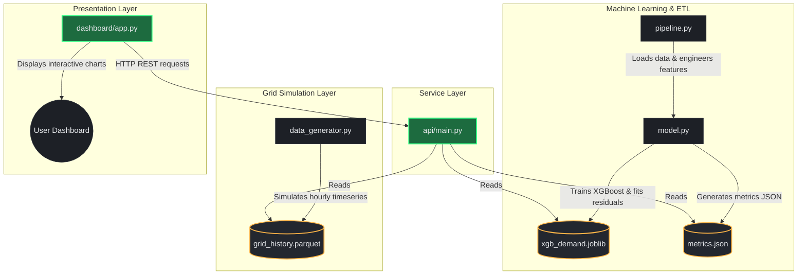

# 📖 StromCast Developer Wiki & Technical Reference

Welcome to the **StromCast** developer wiki. This page contains a deep-dive explanation of the system architecture, the mathematical formulas governing the grid simulator, the recursive XGBoost forecasting model, and the REST API reference.

---

## 🏗️ System Architecture

StromCast is designed as a modular, decoupled forecasting application. The flow of data runs from the stochastic grid simulator to the persistence layer, which feeds the training pipeline. The trained model is served via a FastAPI REST service, which is consumed by the Streamlit user interface.



### Module Breakdown

1. **`run.py` (Orchestration):** A master process runner that launches the FastAPI backend and Streamlit dashboard concurrently, monitors child process health, and redirects output.
2. **`src/config.py` (Central Constants):** Contains directory paths, simulator constants, feature engineering settings, XGBoost hyperparameters, and network port configurations.
3. **`src/data_generator.py` (Local Physics Engine):** A deterministic, seed-based generator that models realistic hourly German national grid load, temperatures, wind/solar capacity factors, and day-ahead market prices.
4. **`src/model.py` (Machine Learning Wrapper):** Houses the feature engineering engine, the XGBoost training loop, residual calculation, and the recursive out-of-sample multi-step forecasting engine.
5. **`src/pipeline.py` (ETL Pipeline):** Orchestrates training, handles persistence, manages lazy singletons for model caching, and computes forecast horizons.
6. **`src/api/main.py` (FastAPI Server):** Exposes high-performance endpoints for health status, actuals, forecasts (with what-if injections), and model retraining.
7. **`dashboard/app.py` (Streamlit App):** A high-fidelity dark-themed dashboard presenting live forecasts, what-if sliders, correlation analysis, and model health.

---

## 🧮 Mathematical Model of the Simulator

To ensure a realistic playground without relying on external API keys, `src/data_generator.py` implements mathematical representations of German grid behaviors:

### 1. Temperature Simulation
Temperature ($T_t$) models seasonal climatology, diurnal cycle, and multi-day autocorrelated weather fronts (heatwaves and cold snaps):
$$T_t = \bar{T} + T_{\text{seasonal}} + T_{\text{diurnal}} + \eta^{\text{daily}}_t + \epsilon_t$$
Where:
* **Annual Mean ($\bar{T}$):** $9.5^\circ\text{C}$ (German annual average).
* **Seasonal Amplitude ($T_{\text{seasonal}}$):** $10.0^\circ\text{C}$, coldest in mid-January, warmest in late July:
  $$T_{\text{seasonal}} = -10.0 \cdot \cos\left(2\pi \frac{\text{dayofyear} - 20}{365.25}\right)$$
* **Diurnal Amplitude ($T_{\text{diurnal}}$):** $4.5^\circ\text{C}$, minimum at 05:00, maximum at 15:00:
  $$T_{\text{diurnal}} = -4.5 \cdot \cos\left(2\pi \frac{\text{hour} - 15}{24}\right)$$
* **Weather Regime ($\eta^{\text{daily}}_t$):** An AR(1) daily process upsampled to hourly, representing persistent weather fronts:
  $$\eta^{\text{daily}}_d = 0.92 \cdot \eta^{\text{daily}}_{d-1} + \mathcal{N}(0, 2.6)$$
* **Noise ($\epsilon_t$):** Stochastic noise $\mathcal{N}(0, 1.6)$.

### 2. Wind and Solar Capacity Factors
* **Wind Capacity Factor:** Modeled with higher capacity factors in winter and an hourly AR(1) front persistence ($\phi = 0.96$):
  $$CF_{\text{wind}, t} = 0.24 - 0.06 \cdot \cos\left(2\pi \frac{\text{dayofyear} - 10}{365.25}\right) + \eta^{\text{wind}}_t$$
* **Solar Capacity Factor:** Models day/night daylight cycles with seasonal daylight hours (broader bell curve in summer) modulated by cloud cover (daily AR(1) multiplier):
  $$CF_{\text{solar}, t} = 0.78 \cdot \text{daylight}_t \cdot \text{seasonal\_peak}_t \cdot \text{cloud\_multiplier}_d$$

### 3. Grid Demand Model
The hourly demand ($D_t$ in MW) is calculated deterministically from temporal components and weather interactions, plus behavioral noise:
$$D_t = L_{\text{base}} + D_{\text{diurnal}} + D_{\text{weekend}} + D_{\text{seasonal}} + H_t + C_t - \text{Holiday\_Reduction} + \epsilon_t$$
Where:
* **Base Load ($L_{\text{base}}$):** $56,000\text{ MW}$.
* **Diurnal Load Shape ($D_{\text{diurnal}}$):** Twin peaks matching German load profiles (morning ramp at 08:00 and higher evening peak at 19:00, overnight trough at 04:00):
  $$S(h) = 0.85 \cdot e^{-\frac{(h-8)^2}{2(2.2)^2}} + 1.0 \cdot e^{-\frac{(h-19)^2}{2(2.6)^2}} - 0.9 \cdot e^{-\frac{(h-4)^2}{2(3.0)^2}}$$
  $$D_{\text{diurnal}} = S(h) \cdot 11,000\text{ MW}$$
* **Weekend Reduction ($D_{\text{weekend}}$):** Saturday drops demand by $0.55 \times 7,000\text{ MW}$; Sunday drops it by $1.0 \times 7,000\text{ MW}$.
* **Seasonal Load ($D_{\text{seasonal}}$):** $6,500\text{ MW}$ cosine shift representing shorter winter days:
  $$D_{\text{seasonal}} = -6,500 \cdot \cos\left(2\pi \frac{\text{dayofyear} - 15}{365.25}\right)$$
* **Heating Degree Load ($H_t$):** Triggers if temperature drops below comfort threshold ($16^\circ\text{C}$):
  $$H_t = \max(0, 16 - T_t) \cdot 520\text{ MW/}^\circ\text{C}$$
* **Cooling Degree Load ($C_t$):** Triggers if temperature exceeds comfort threshold ($16^\circ\text{C}$):
  $$C_t = \max(0, T_t - 16) \cdot 380\text{ MW/}^\circ\text{C}$$
* **Holiday Reduction:** $9,000\text{ MW}$ drop on nationwide German public holidays.

### 4. Day-Ahead spot price (Merit-Order Effect)
Prices track the residual grid load (demand minus wind/solar contributions):
$$\text{Residual Load}_t = D_t \cdot (1 - 0.55 \cdot CF_{\text{wind}, t} - 0.45 \cdot CF_{\text{solar}, t})$$
$$\text{Price}_t = 85.0 + 0.0016 \cdot (\text{Residual Load}_t - 56,000) - 70.0 \cdot (0.6 \cdot CF_{\text{wind}, t} + 0.4 \cdot CF_{\text{solar}, t}) + \mathcal{N}(0, 9.0)$$
Clipped between a floor of $-50.0\text{ \euro}$ and a cap of $600.0\text{ \euro}$.

---

## 🤖 XGBoost Forecasting Pipeline

The forecasting pipeline engineers tabular features from raw history and uses an XGBoost regressor for prediction.

### Feature Engineering
For any given timestamp $t$, the features are built using historical demand values up to $t-1$ (preventing data leakage) and exogenous drivers at $t$:

* **Lags:** $D_{t-1}$, $D_{t-2}$, $D_{t-3}$, $D_{t-24}$ (1 day ago), $D_{t-48}$ (2 days ago), $D_{t-168}$ (1 week ago).
* **Rolling Windows:** 3h, 24h, and 168h rolling mean and standard deviation on the shifted target.
* **Exogenous Features:** Temperature ($T_t$), wind capacity ($CF_{\text{wind}, t}$), solar capacity ($CF_{\text{solar}, t}$), EPEX price ($P_t$).
* **Calendar Encodings:** Cyclical sine/cosine transformations of hour-of-day and day-of-year:
  $$\text{hour\_sin} = \sin\left(\frac{2\pi \cdot \text{hour}}{24}\right), \quad \text{hour\_cos} = \cos\left(\frac{2\pi \cdot \text{hour}}{24}\right)$$

### Recursive Forecasting Loop
Because predicting multiple steps ahead (up to 7 days / 168 hours) requires inputs that are not yet observed, StromCast uses a **recursive forecasting mechanism**:

```
[History (t-168 to t)] ──▶ add_features() ──▶ XGBoost.predict() ──▶ Predicted Demand (t+1)
                                                                            │
   ┌────────────────────────────────────────────────────────────────────────┘
   ▼
[Update Lags & Rolling Window] ──▶ add_features() ──▶ XGBoost.predict() ──▶ Predicted Demand (t+2)
```

1. To forecast hour $t+1$, lag features are computed from observed history.
2. The model predicts $\hat{D}_{t+1}$.
3. $\hat{D}_{t+1}$ is appended to the historical series, acting as the $D_{t}$ lag input for predicting hour $t+2$.
4. This cycle repeats recursively up to the configured horizon (24 or 168 steps).

### Dynamic Confidence Bands
As errors compound through the recursive steps, the uncertainty band widens relative to the square root of the step count, capped at 24 hours of compound propagation:
$$\text{Band}_s = 1.96 \cdot \sigma_{\text{residuals}} \cdot \sqrt{\min(s, 24)}$$
Where $\sigma_{\text{residuals}}$ is the standard deviation of residuals on the validation set ($\approx 1,185.9\text{ MW}$).

---

## 🔌 FastAPI REST Developer Reference

FastAPI serves the forecast and model statistics on port `8000`.

### Endpoints Table

| Endpoint | Method | Parameter | Description |
| :--- | :---: | :--- | :--- |
| `/api/v1/health` | `GET` | None | Returns backend status, parquet history status, and whether the model is trained. |
| `/api/v1/actuals` | `GET` | `hours` (default: 168) | Returns historical observed demand, temperatures, pricing, and renewable inputs. |
| `/api/v1/metrics` | `GET` | None | Returns validation metrics (RMSE, MAE, MAPE, R²), training row counts, and top feature importances. |
| `/api/v1/forecast` | `GET` | `horizon` (24/168), what-if factors | Returns out-of-sample recursive forecasts with custom what-if inputs. |
| `/api/v1/train` | `POST` | None | Triggers pipeline retraining on the historical dataset and refreshes the cached model singleton. |

### `/forecast` What-If Query Parameters

Grid analysts can simulate structural changes by calling `/forecast` with these parameters:
* `temp_delta_c` (float, default `0.0`): Shift future temperatures (e.g. `-10.0` for a cold snap).
* `solar_factor` (float, default `1.0`): Multiplier for solar output (e.g. `0.0` for full cloud).
* `wind_factor` (float, default `1.0`): Multiplier for wind output (e.g. `2.0` for wind storm).
* `price_factor` (float, default `1.0`): Price multiplier (e.g. `1.5` for market price hike).

---

## 🎨 Dashboard Interface Showcase

Here are the visual interfaces of the Streamlit dashboard:

### 1. Interactive Forecast View
Shows actual demand, in-sample fits, and out-of-sample recursive forecasts with dynamic uncertainty bands.


### 2. Price vs. Demand Analysis
Displays the relationship between market pricing and load, illustrating negative prices during periods of renewable surplus.

